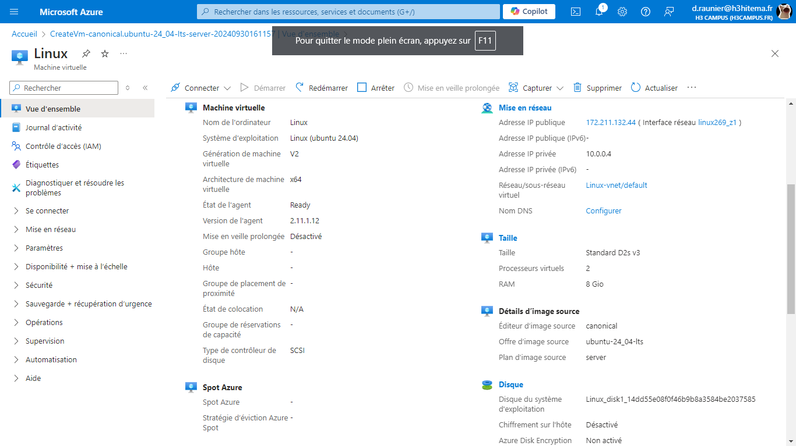

# Lab 1: Creating and Managing Azure Virtual Machines

## 1. Deploy a Windows and a Linux virtual machine (VM) in Azure.

---

## 2. Configure VM sizes, storage options, and networking settings.

---

## 3. Connect to the VMs using Remote Desktop Protocol (RDP) and Secure Shell (SSH).

---

## 4. Install software on the VMs and take snapshots.

---

