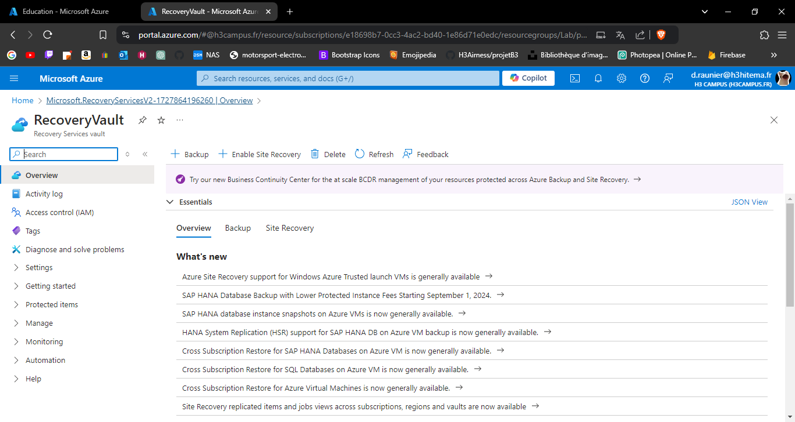
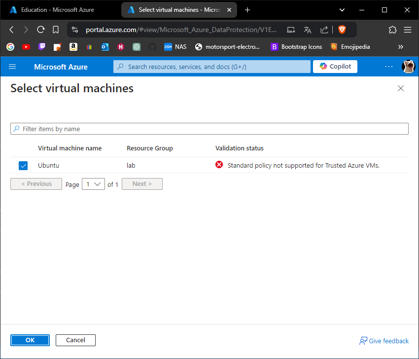
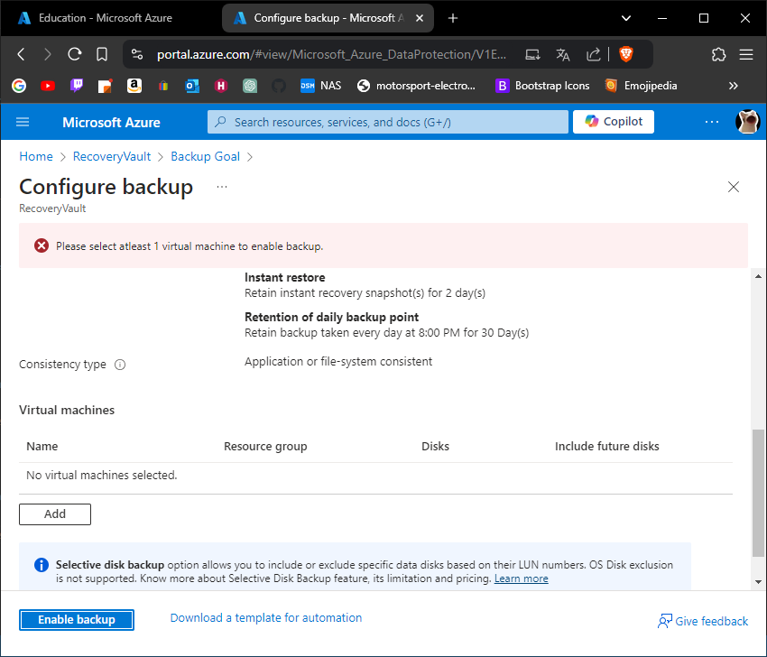
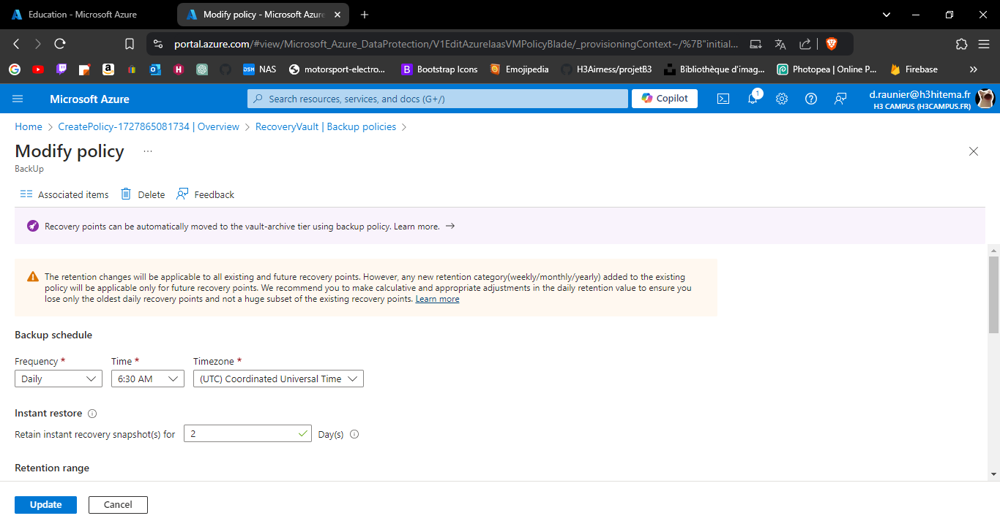

# Lab 10: Configuring Azure Backup and Recovery Services

## 1. Create a Recovery Services Vault.

---

## 2. Configure backup for VMs and Azure Files.

---

## 3. Perform a backup and restore operation.

Impossible à réaliser, car je n'ai pas pu créer de sauvegarde.

---

## 4. Implement backup policies and retention.

---

