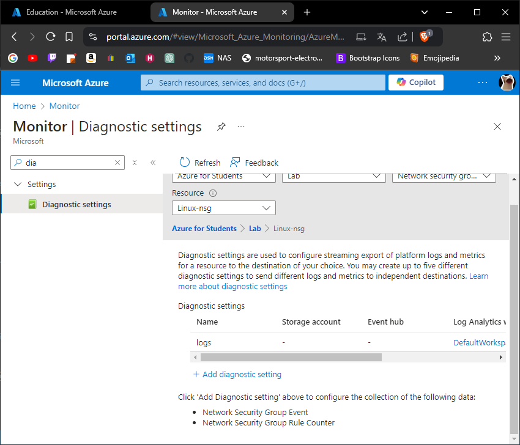
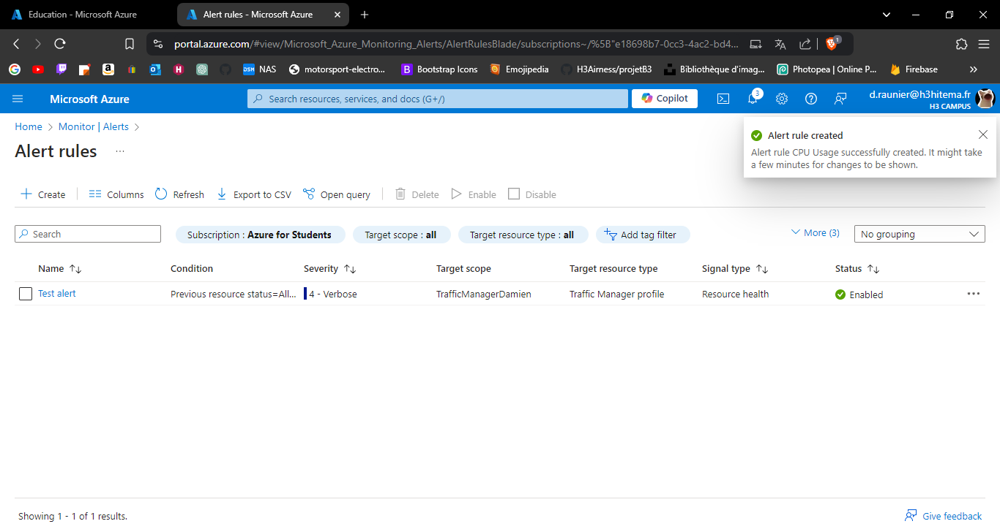
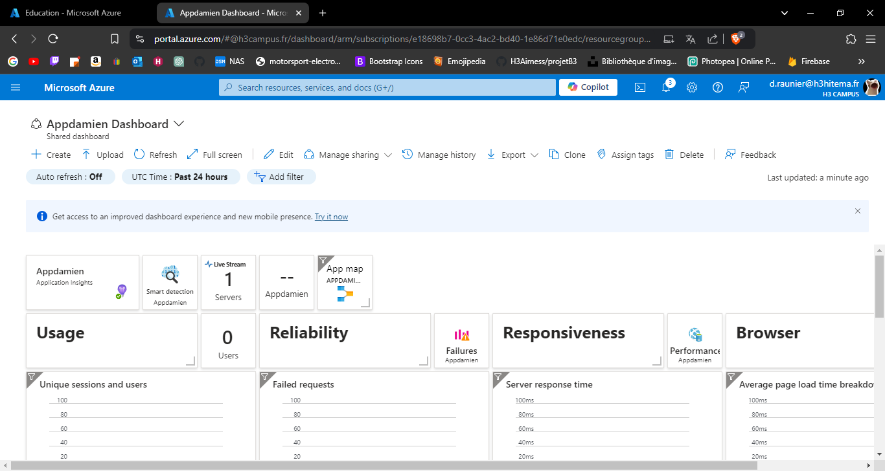
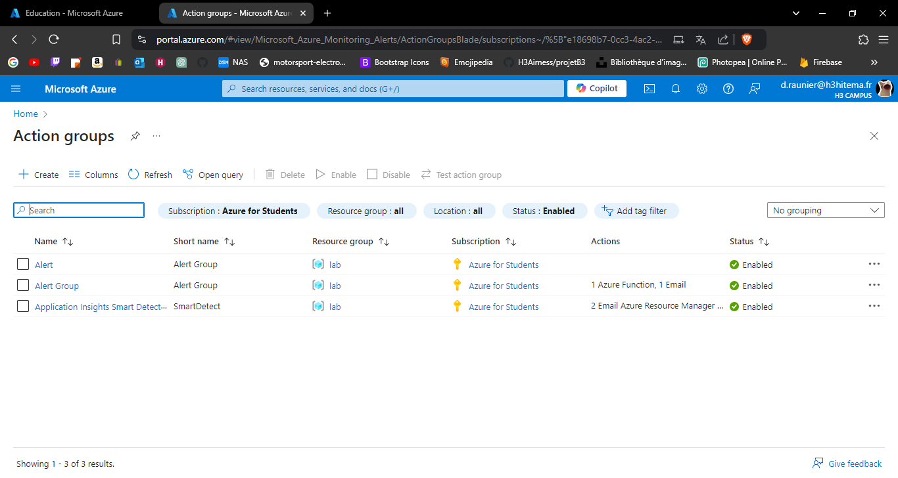

# Lab 11: Implementing Azure Monitor and Alerts

## Set up Azure Monitor to collect metrics and logs.

---

## 2. Create alerts based on resource metrics.

---

## 3. Visualize data using Azure dashboards.

---

## 4. Implement Action Groups for alert notifications.

---

