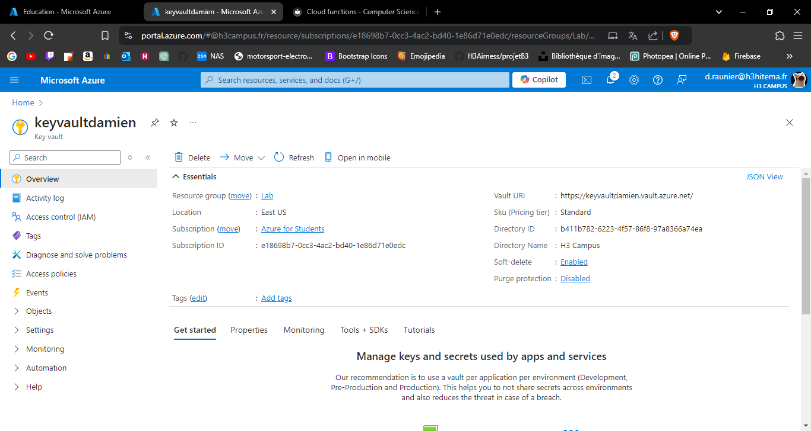
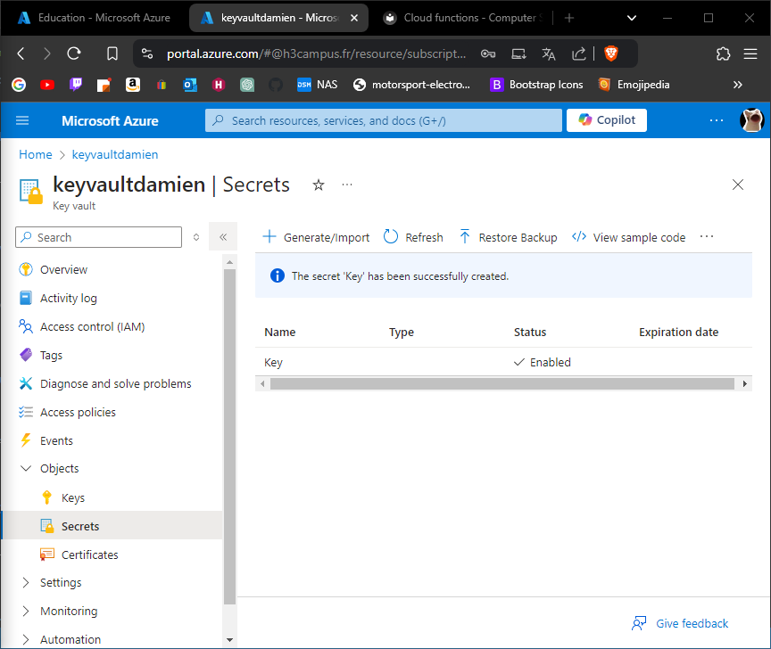
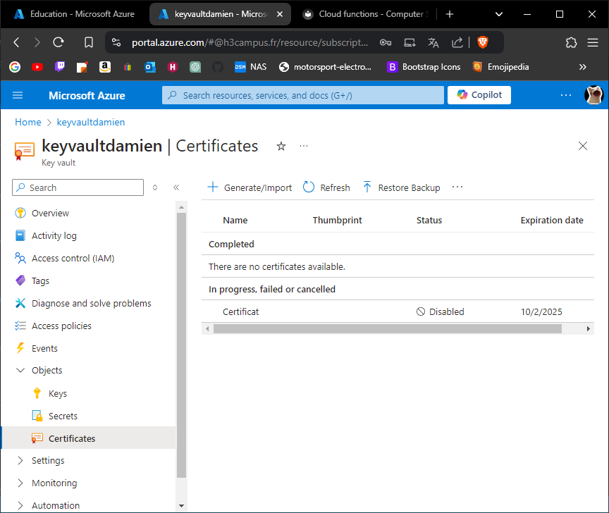
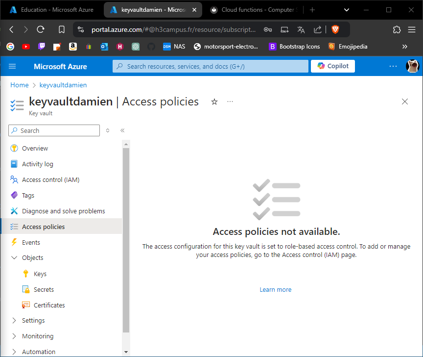
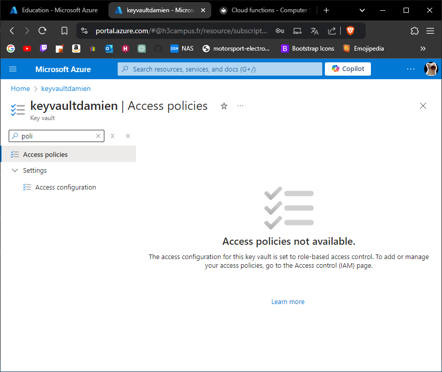

# Lab 13: Implementing Azure Key Vault

## 1. Create an Azure Key Vault.



---

## 2. Store and retrieve secrets, keys, and certificates.




---

## 3. Integrate Key Vault with an application for secret management.



---

## 4. Set up access policies and monitoring.



---

## 5. Try to use one of your key inside an application

```
var client = new CryptographyClient(new Uri(kvUri), new DefaultAzureCredential());

byte[] plaintext = Encoding.UTF8.GetBytes("My secret data");

EncryptResult encryptResult = client.Encrypt(EncryptionAlgorithm.RsaOaep, plaintext);

Console.WriteLine($"Encrypted data: {Convert.ToBase64String(encryptResult.Ciphertext)}");
```
---

