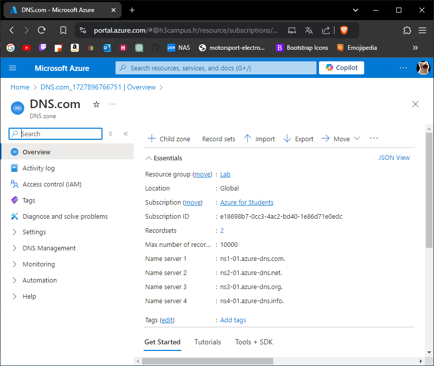
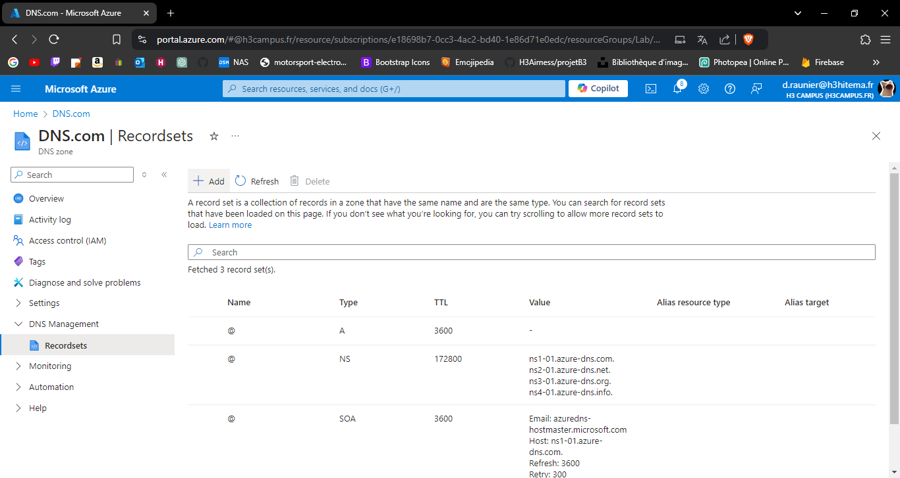
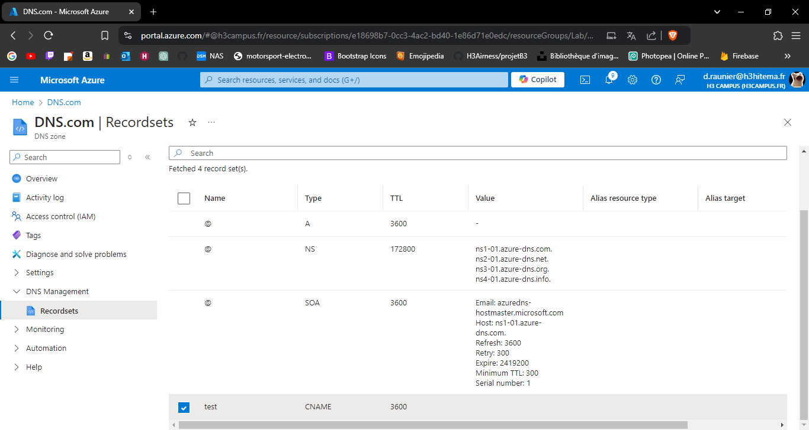

# Lab 14: Configuring Azure DNS and Custom Domains

## 1. Create an Azure DNS Zone.

---

## 2. Manage DNS records for a custom domain.

---

## 3. Configure domain verification and mapping for Azure services.

Pas de domaine dispo

---

## 4. Implement DNS aliases (CNAME) and record sets.

---

