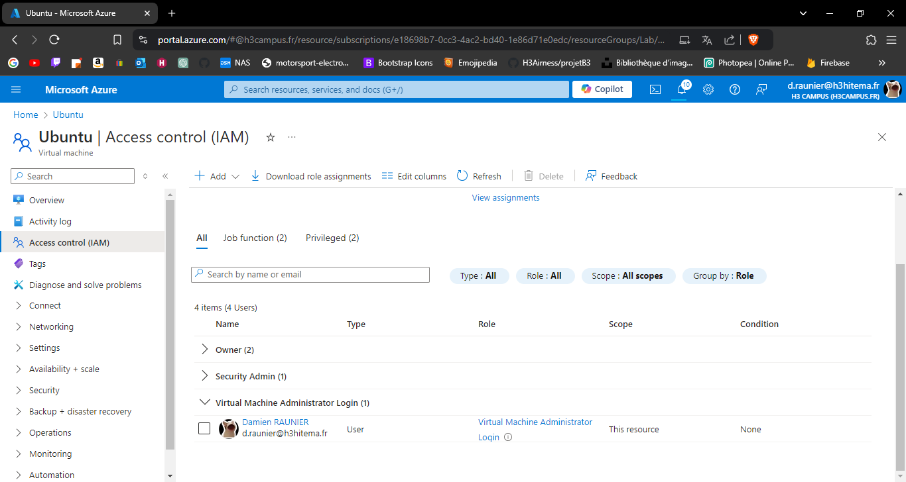
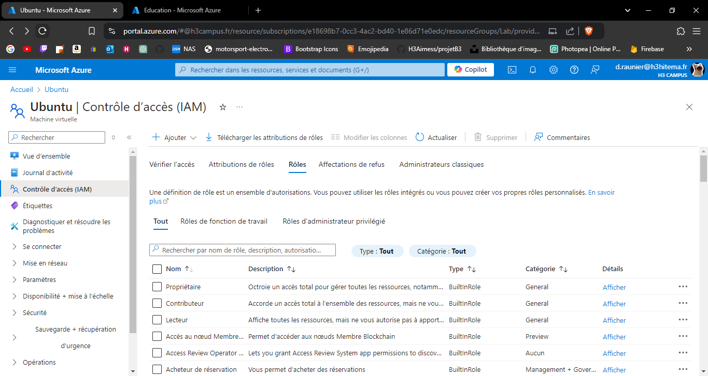
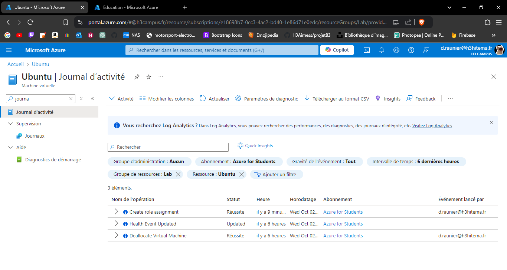

# Lab 16: Managing Role-Based Access Control (RBAC)

## 1. Assign built-in roles to users and groups.

---

## 2. Create custom roles with specific permissions.

---

## 3. Test access levels for different roles.

À tester avec un autre compte.

---

## 4. Audit access using activity logs.

---

