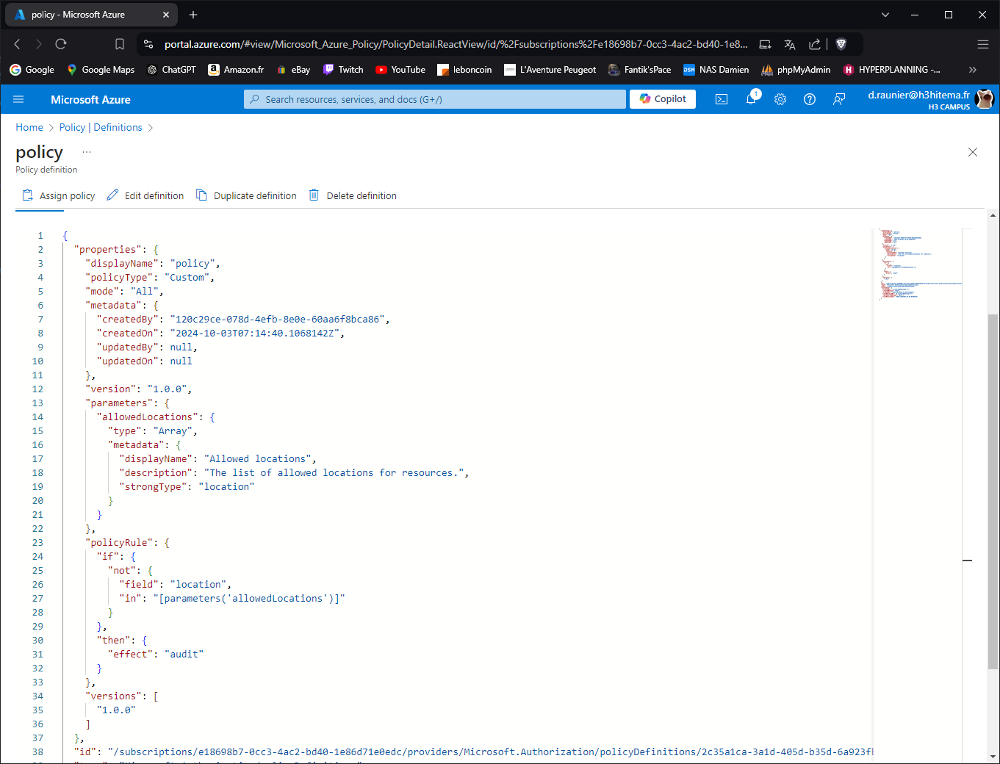
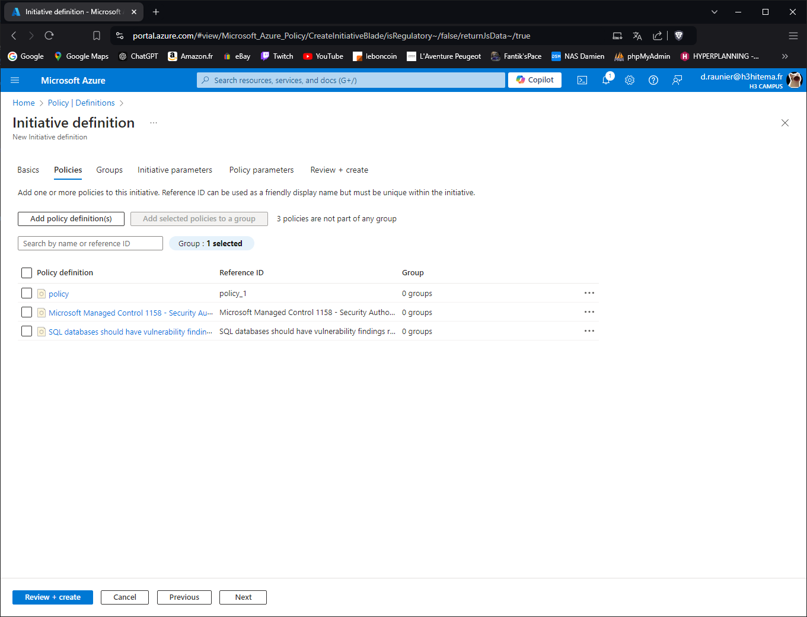
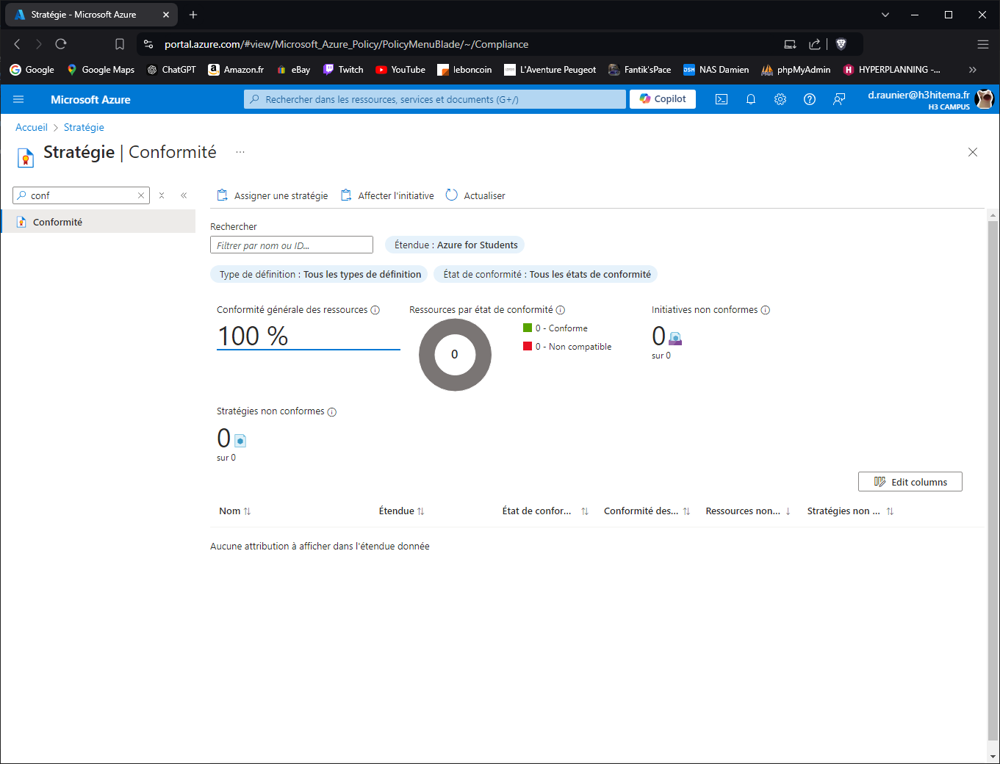

# Lab 17: Implementing Azure Policy and Governance

## 1. Create and assign Azure Policies to enforce compliance.

---

## 2. Use initiatives to group multiple policies.

---

## 3. Remediate non-compliant resources.

Impossible de créer une "Initiative definition".

---

## 4. Analyze compliance reports.

---

