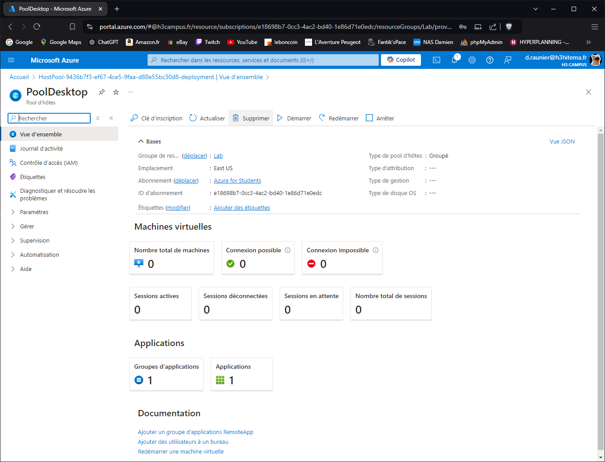
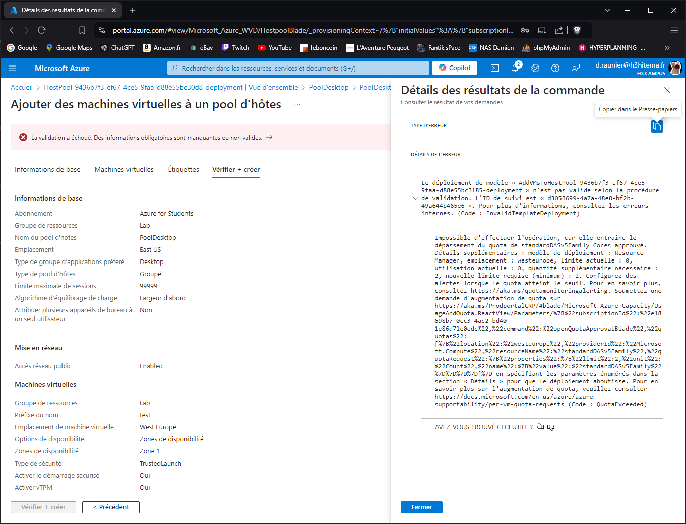
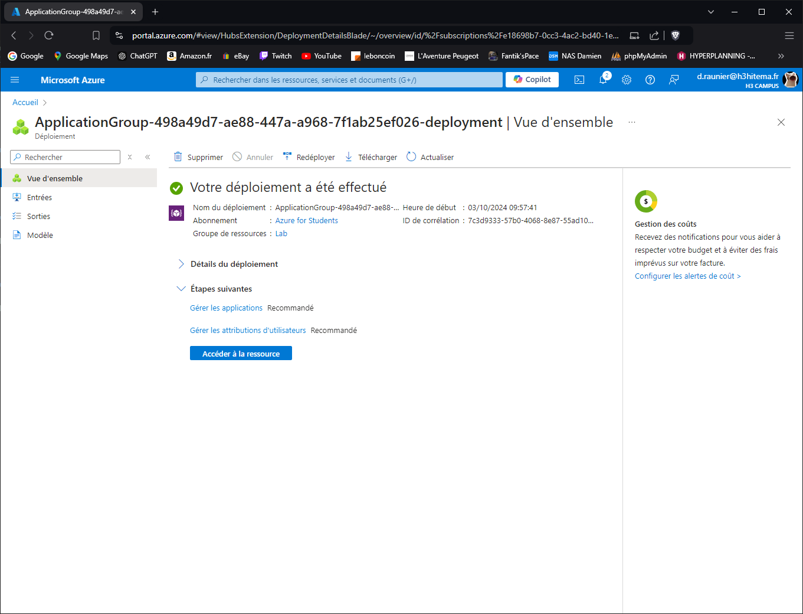

# Lab 18: Configuring Azure Virtual Desktop

## 1. Set up Azure Virtual Desktop environment.

---

## 2. Configure host pools, session hosts, and workspaces.

---

## 3. Publish remote desktop applications.

---

## 4. Connect to the virtual desktops as a user.

Impossible car l'abonnement ne le permet pas (pas assez de crédit)

---

