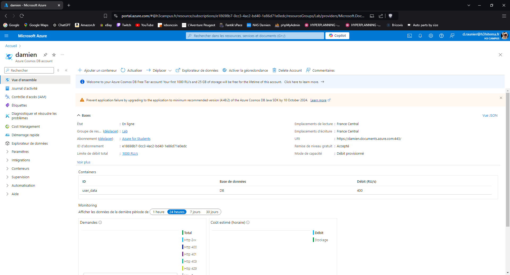
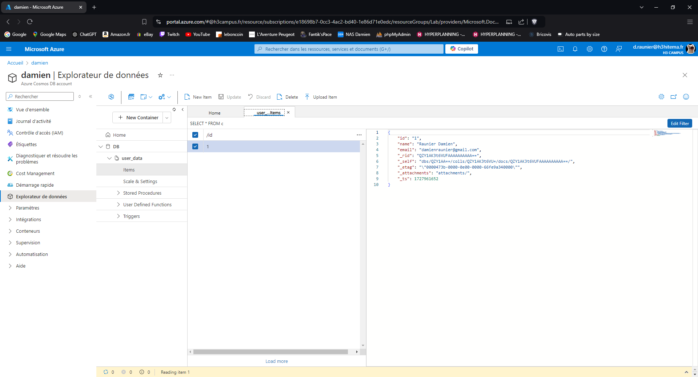
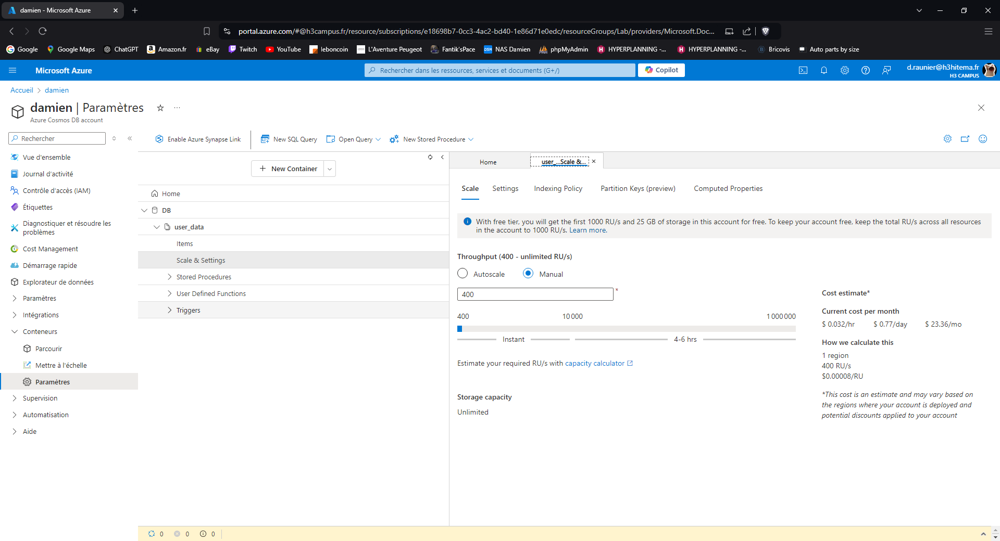
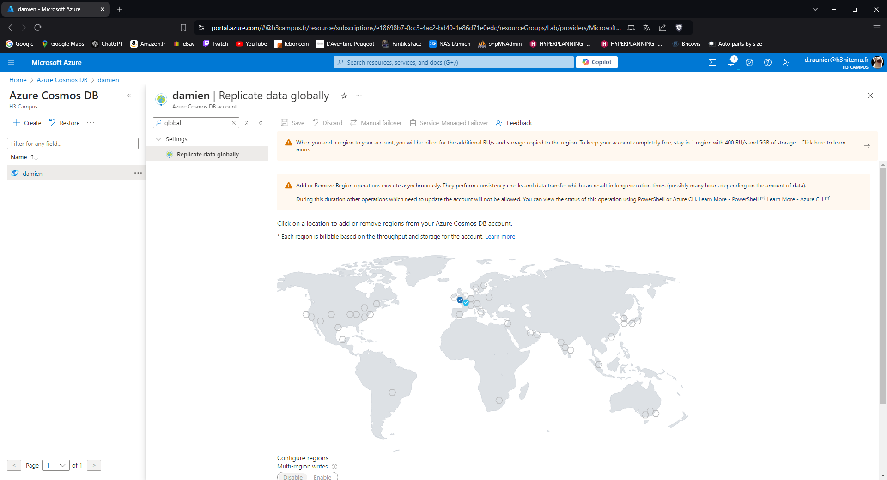

# Lab 19: Implementing Azure Cosmos DB

## 1. Create a Cosmos DB account with a chosen API (SQL, MongoDB, etc.).

---

## 2. Insert and query data using the Data Explorer.

---

## 3. Configure throughput and partitioning.

---

## 4. Implement Global Distribution.

---

