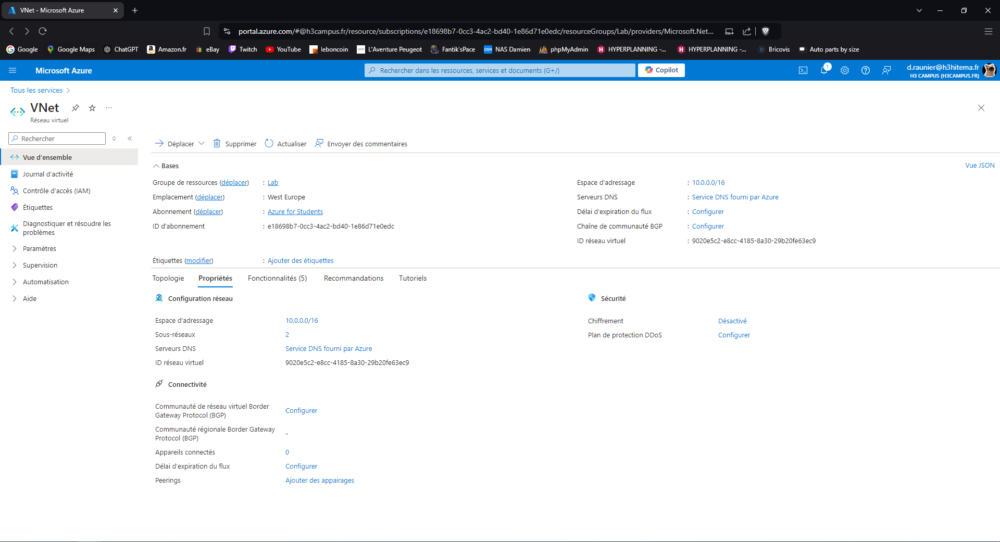
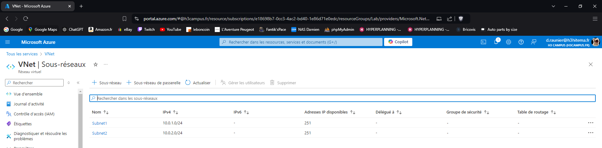
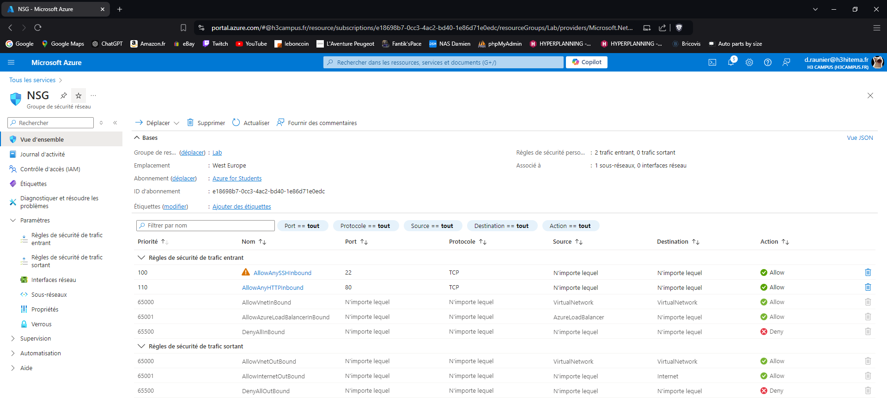
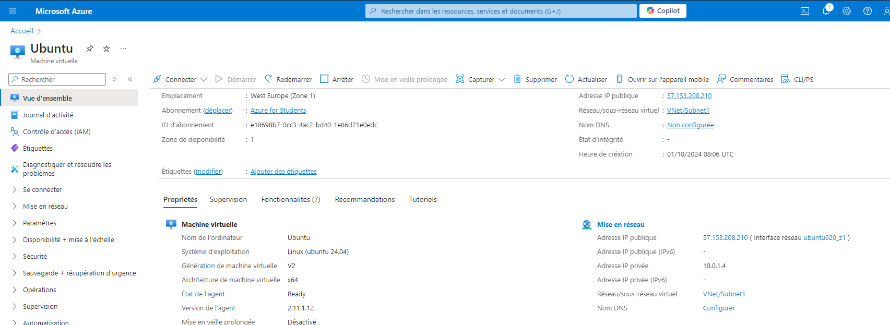
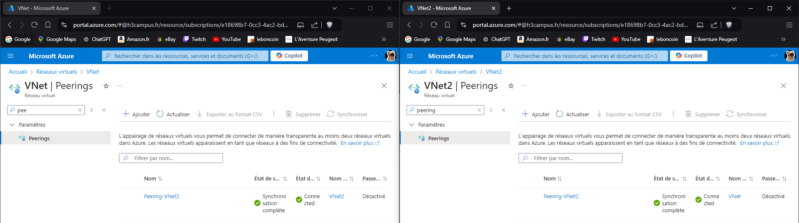

# Lab 2: Implementing Azure Virtual Networks

## 1. Create a Virtual Network (VNet) with multiple subnets.

---

## 2. Set up Network Security Groups (NSGs) to control inbound and outbound traffic.

---

## 3. Deploy VMs into specific subnets.

---

## 4. Configure VNet peering between two VNets.

---

