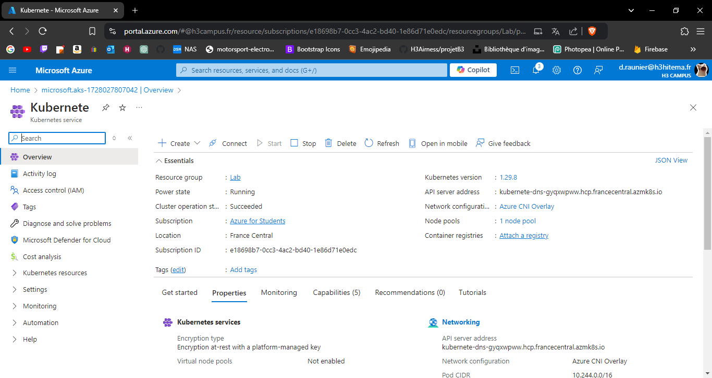
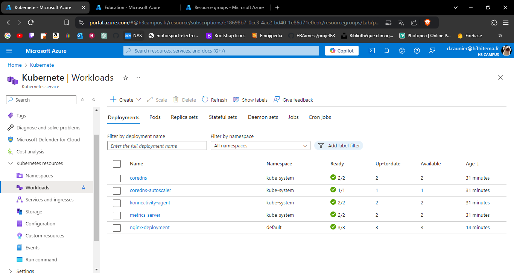
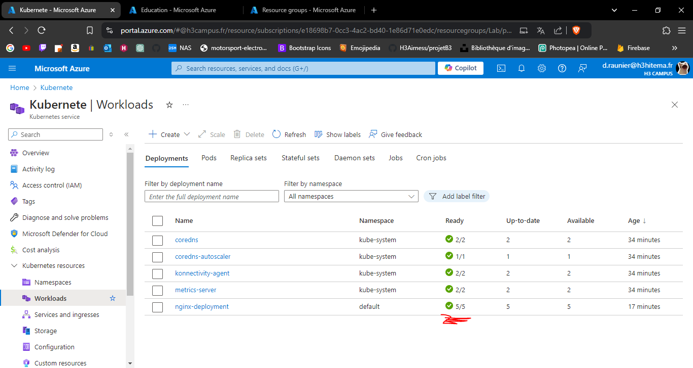
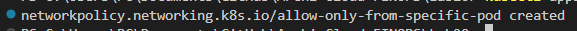

# Lab 20: Deploying Azure Kubernetes Service (AKS)

## 1. Set up an AKS cluster.

---

## 2. Deploy a containerized application using Kubernetes manifests.

---

## 3. Scale applications and manage pods.

---

## 4. Implement network policies for pod communication.

---

