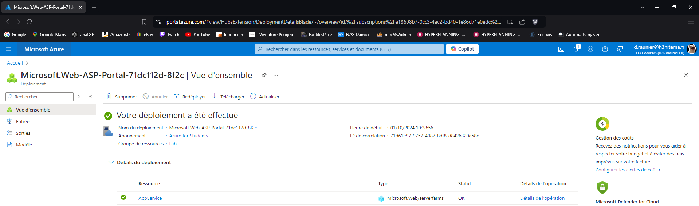
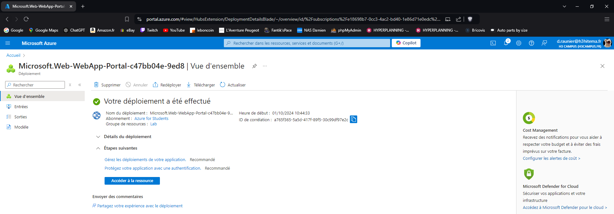
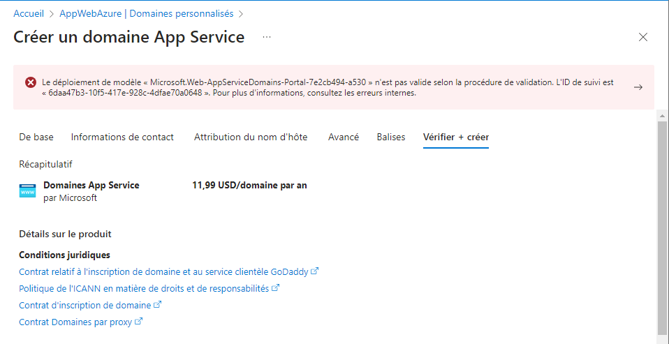
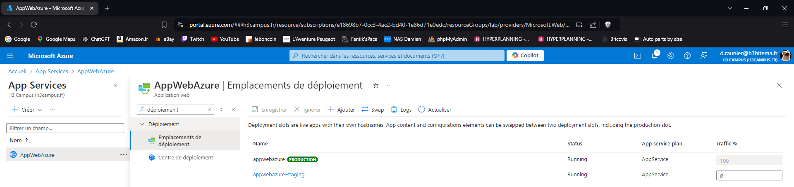

# Lab 3: Deploying Azure App Service Web Apps

## 1. Create an Azure App Service plan.

---

## 2. Deploy a web application using Azure App Service.

---

## 3. Configure custom domains and SSL certificates.

---

## 4. Implement deployment slots for staging and production.

---

