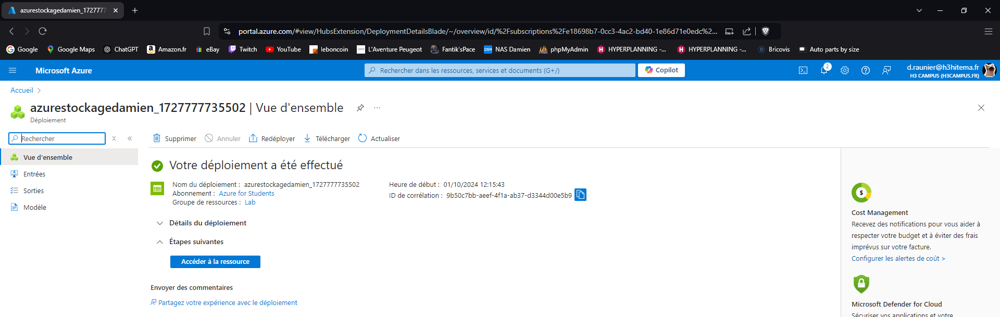
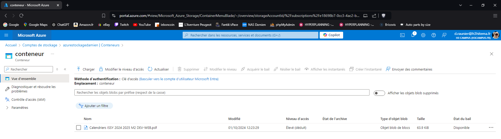
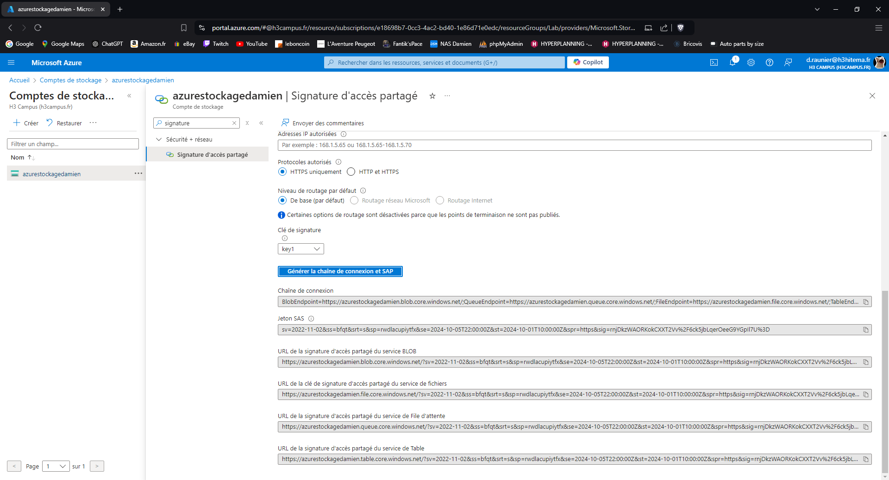
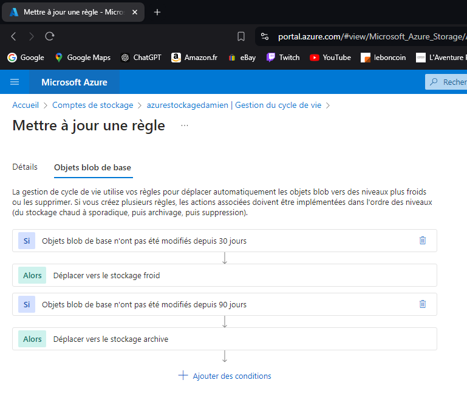

# Lab 4: Managing Azure Storage Accounts and Blobs

## 1. Create a Storage Account with different replication options.

---

## 2. Upload and manage blobs using Azure Portal and Azure CLI.

---

## 3. Set up Shared Access Signatures (SAS) for secure access.

---

## 4. Implement lifecycle management policies.

---

