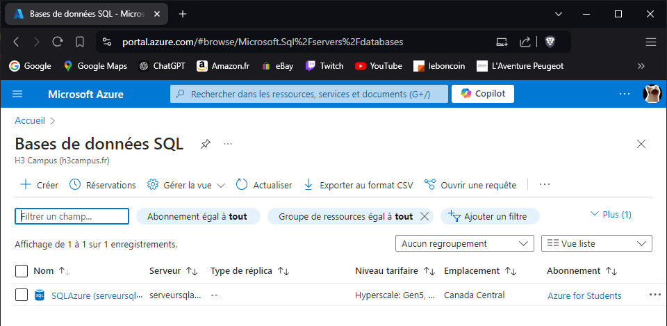
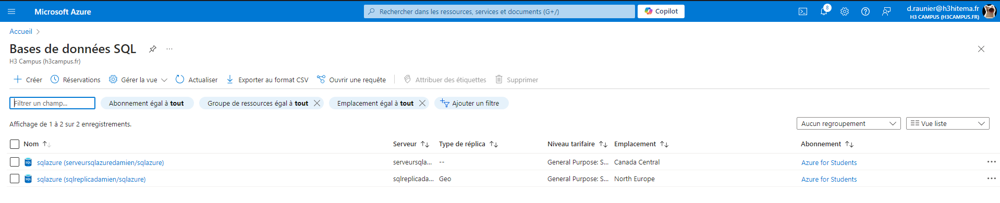

# Lab 5: Implementing Azure SQL Databases

## 1. Deploy an Azure SQL Database instance.

---

## 2. Configure firewall settings to allow client access.

---

## 3. Import data into the database.

az sql db import --resource-group <NomDuGroupeDeRessources> \
                 --server <NomDuServeurSQL> \
                 --name <NomDeLaBaseDeDonnées> \
                 --admin-user <NomDeLAdministrateurSQL> \
                 --admin-password <MotDePasseAdmin> \
                 --storage-uri <URI-du-fichier-BACPAC> \
                 --storage-key <CléDeStockage> \
                 --storage-key-type StorageAccessKey

---

## 4. Implement Geo-replication for high availability.

---

