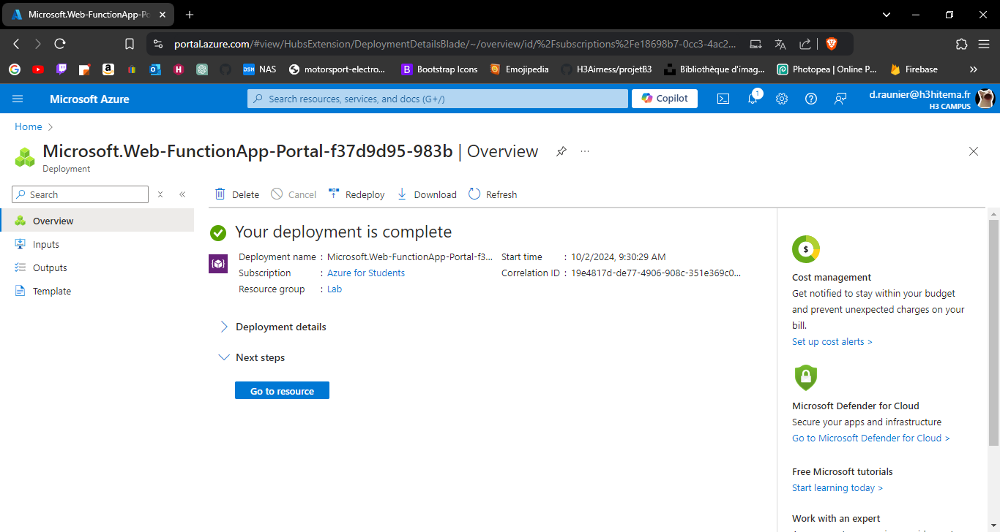
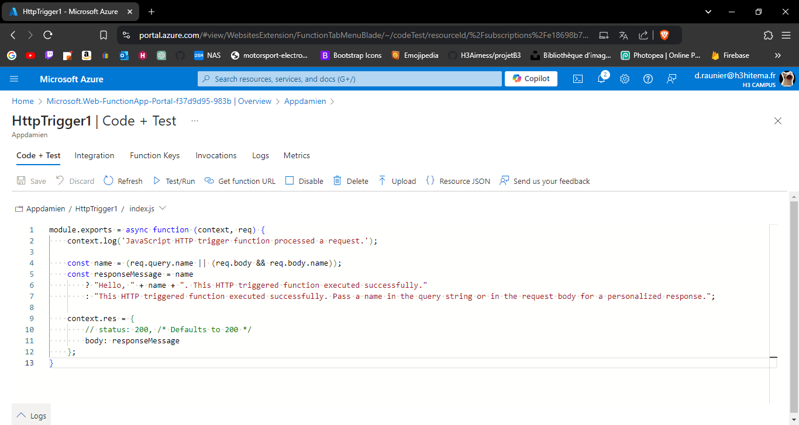
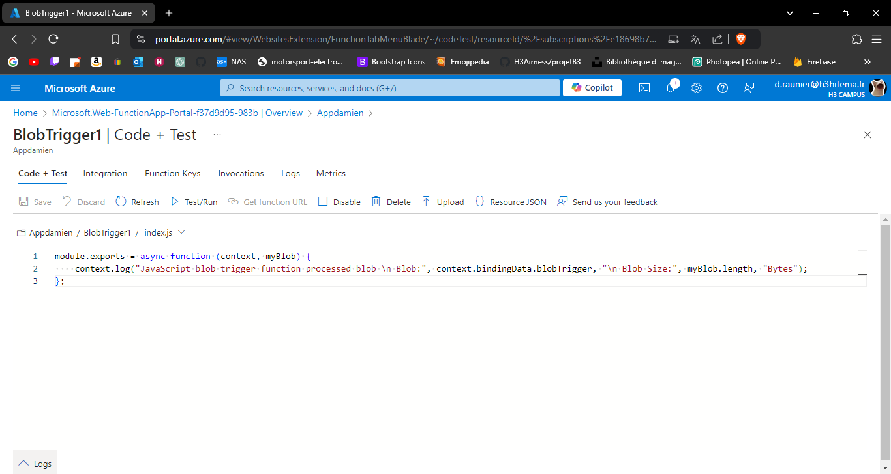
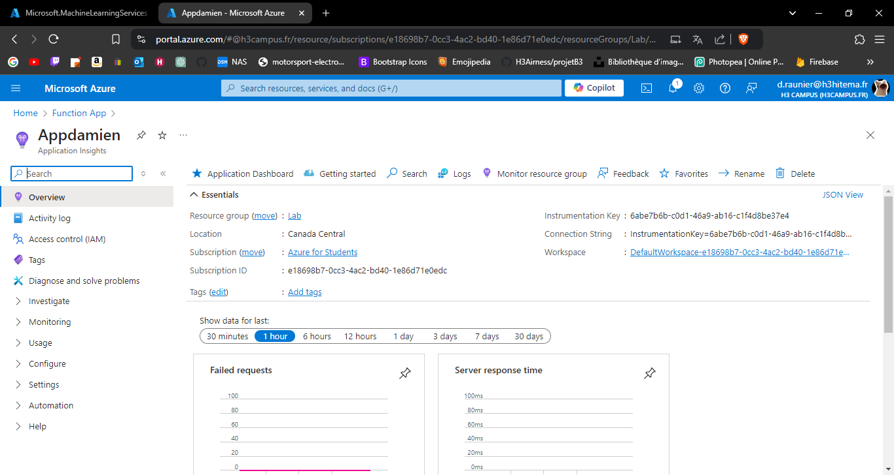

# Lab 7: Implementing Azure Functions

## 1. Create an Azure Function App.

---

## 2. Develop a serverless function triggered by an HTTP request.

---

## 3. Integrate the function with Azure Storage or Azure Queue.

---

## 4. Monitor function performance and logs.

---

