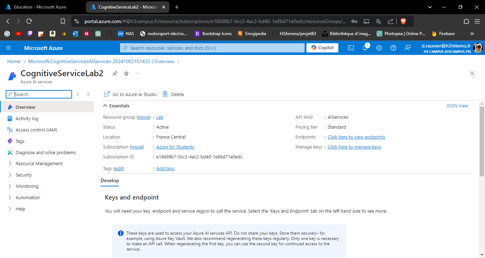
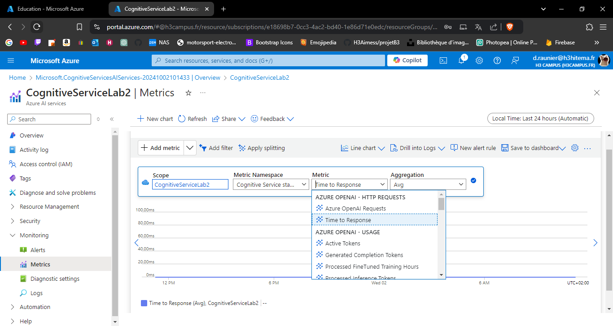

# Lab 8: Using Azure Cognitive Services

## 1. Create a Cognitive Services resource.



---

## 2. Develop an application that uses the Text Analytics API.

Exemple de code Python pour interagir avec l'API Text Analytics et analyser le texte :

```
from azure.ai.textanalytics import TextAnalyticsClient
from azure.core.credentials import AzureKeyCredential

# Clé API et point de terminaison
key = "VOTRE_CLE_API"
endpoint = "VOTRE_URL_DE_POINT_DE_TERMINAISON"

# Authentification
def authenticate_client():
    ta_credential = AzureKeyCredential(key)
    text_analytics_client = TextAnalyticsClient(
        endpoint=endpoint, credential=ta_credential)
    return text_analytics_client

client = authenticate_client()

# Exemple de fonction pour analyser le sentiment
def analyze_sentiment_example(client):
    documents = [
        "J'adore utiliser Azure Cognitive Services. C'est génial!"
    ]
    response = client.analyze_sentiment(documents=documents)[0]
    print("Document sentiment:", response.sentiment)
    print("Confidence scores:", response.confidence_scores)

analyze_sentiment_example(client)

```
---

## 3. Analyze sentiment and key phrases from sample text.

Non réalisé, car l'étape 2 n'a pas été effectuée.

---

## 4. Monitor API usage and manage keys.



---

