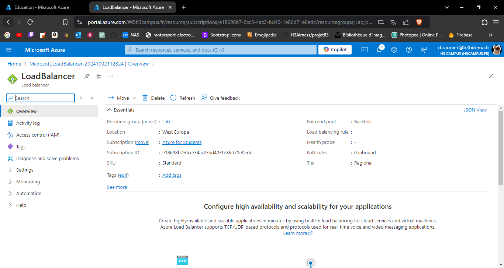
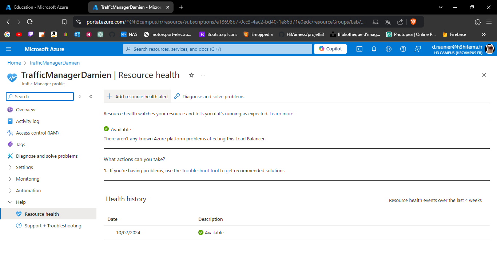
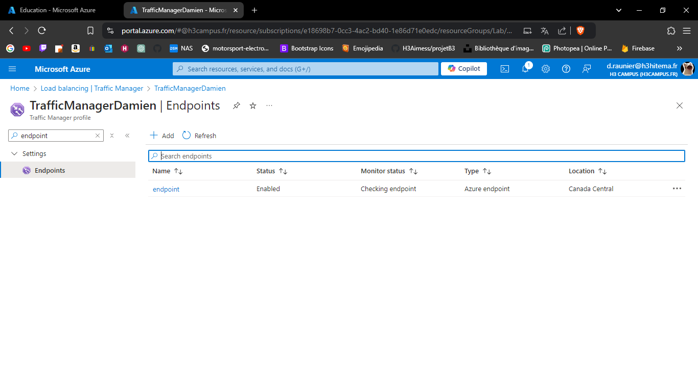

# Lab 9: Implementing Azure Load Balancer and Traffic Manager

## 1. Deploy Azure Load Balancer to distribute traffic across VMs.

---

## 2. Configure health probes and load balancing rules.

---

## 3. Set up Azure Traffic Manager for DNS-based traffic routing.

---

## 4. Test failover scenarios.

Non réalisé, car impossible de créer un second endpoint.

---

